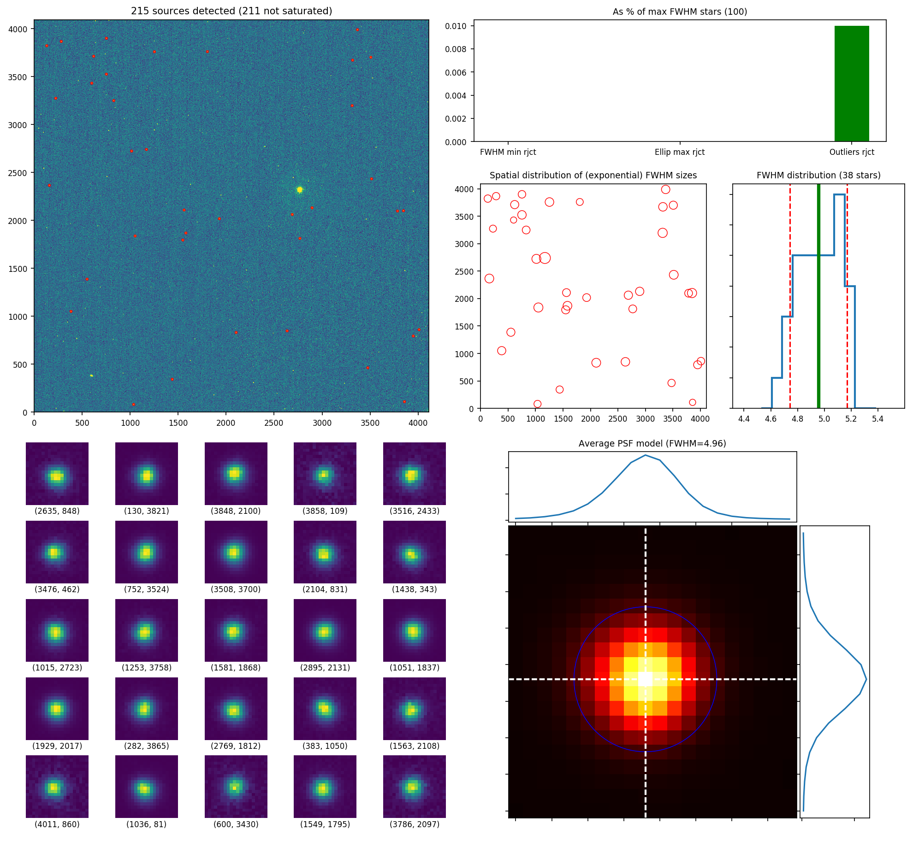
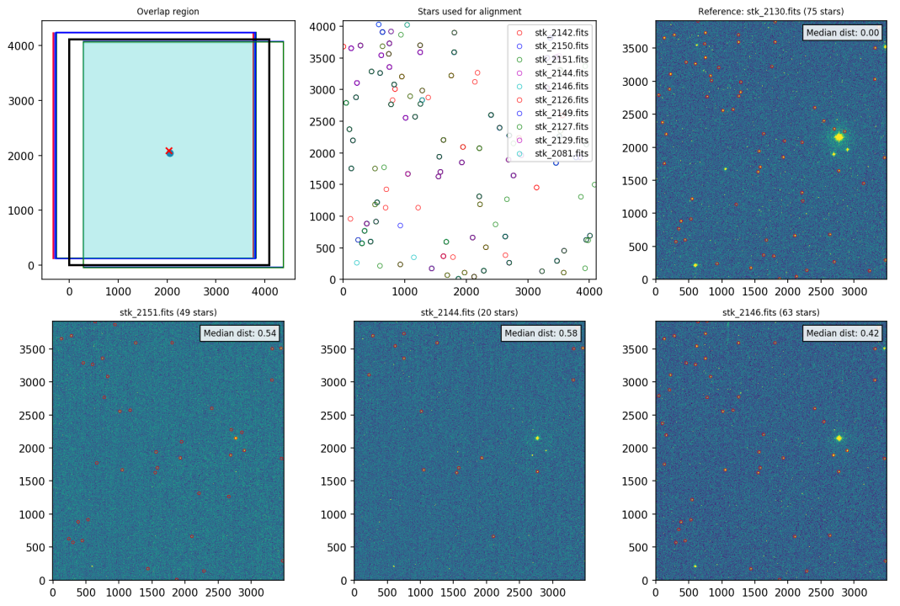

Getting started
===============

The entire process can be summarized as follows:

1. Position all the input .fits files in the ``input/`` folder.
2. Check the headers of these files to make sure they contain the
   required information.
3. Analyze all files with ``fitstats``, and decide if some of them should be
   discarded.
4. Align and crop your standard and field frames if necessary with the
   ``align_crop`` script. <-- TODO: replace the alignment with a new
   ``pymatch`` script.
5. Identify standard stars in your standard frames using the ``id_standard``
   script.
6. Perform aperture photometry on standard stars with the ``aperphot_standard``
   script.
7. Define and solve the transformation equations to the standard system
   using the ``fit_standard`` script.
8. 

After completing these steps, the final result is a calibrated PSF photometry
analysis of the observed field.

.. _secinput:

Input parameters and folder structure
-------------------------------------

The required input parameters for all the scripts are stored in the
``params_input.dat`` file. This file is structured in blocks, with a *general*
block containing parameters that are common to several tasks on top, and a
block for each script following that.

The code expects standard and field observed frames to exist separately in
corresponding folders within the ``photpy/input/`` folder. The folder structure
must look like this:

.. code-block:: none

    input/
    │
    ├── standards/
    │   ├── stand_001.fits
    │   ├── stand_002.fits
    │   ├── stand_003.fits
    │   └── ...
    │
    ├── field/
    │   ├── field_100.fits
    │   ├── field_101.fits
    │   ├── field_102.fits
    │   └── ...

The names of the ``.fits`` files are not important, as long as their headers
contain all the required information. See the next section to learn of to check
if your headers are correct.

Fixing your headers
-------------------

The parameters **Gain**, **Read noise**, **Filter**, **Exposure time** are
required information that must be present in the *header* of each
``.fits`` file to be processed.

The names of the keys that point to these values in each header are stored in
the ``General observed data parameters`` section of the ``params_input.dat``
file:

* ``gain_key``: Header key for the gain value.
* ``rdnoise_key``: Header key for the noise value.
* ``filter_key``: Header key for the filter's name.
* ``exposure_key``: Header key for the exposure time of the frame.

Additionally, this block also contains the required parameters:

* ``dmin``: Minimum flux value accepted.
* ``dmax``: Maximum flux value of a non-saturated star.

To display the header of a ``.fits``, file you can use the following code:

.. code-block:: python

    from astropy.io import fits

    # Load .fits file
    hdulist = fits.open(image_file)
    # Extract header data
    hdr = hdulist[0].header
    # Display header data
    for k, v in zip(*[hdr.keys(), hdr.values()]):
        print(k, v)

Extract data from your observed frames
--------------------------------------

``fitstats`` parameters

* ``ellip_max``: Maximum accepted ellipticity value.
* ``fwhm_min``: Minimum accepted FWHM value.
* ``sky_method``: BW
* ``thresh_level``: Threshold detection level in units of the sky's STDDEV,
  used by DAOStarFinder.
* ``fwhm_init``: Initial estimate of the FWHM, used by DAOStarFinder.
* ``max_stars``: Maximum number of bright unsaturated stars used to estimate
  the average FWHM of stars in the frame.
* ``do_plots_A``: Flag to determine whether the output plot is produced.
  Accepted inputs are y/n.

The ``fitstats`` script is used to estimate the FWHM, sky mean, and sky standard
deviation for your observed set of standard and field frames.
Once executed, it will go through all the files defined as input 
(see :ref:`secinput` section) and automatically process them.

The steps followed by the script are:

1. Estimate the sky's mean and standard deviation values using the
   `sigma_clipped_stats`__ function.
2. Find candidate stars in the frame through the `DAOStarFinder`__ class.
   Only bright, unsaturated stars are selected.
3. Extract FWHM values for each of the stars selected in the above step,
   using IRAF's `psfmeasure`__ task. Those stars with large ellipticities or
   suspiciously small FWHMs are rejected.
4. Remove outliers with large FWHM values.
5. Obtain mean and standard deviation FWHM values for each frame processed.
6. Save date to files and plot.

The script generates the following output files (where ``xxxxx`` is the name of
the .fits file processed):

* ``xxxxx`` **.coo**: output data with x,y coordinates, `FWHM`, ellipticity,
  and relative magnitude values of the stars selected in the  .fits file.

.. parsed-literal::
    # x      y        FWHM   Ellip  Mag
    2635.46  847.5    5.076  0.02   3.23
    130.46   3820.8   4.788  0.04   1.91
    3848.14  2100.48  5.224  0.04   2.24
    3858.27  108.83   4.468  0.12   4.26
    ...

* ``xxxxx`` **.png**: output image showing the analysis performed on each
  .fits file processed.

* **fitstats.dat**: output file that contains the relevant data found after
  the analysis of either the single .fits file processed, or all the .fits files
  in the processed folder.

.. parsed-literal::
     # image           filter  exposure    Sky_mean  Sky_STDDEV  FWHM_(N_stars)  FWHM_(mean)  FWHM_(std) 
     stk_2153.fits          U      20.0        1.96        3.48              46         4.73        0.70 
     stk_2085.fits          U     250.0       19.36        5.50              14         5.33        0.11 
     stk_2151.fits          U      20.0        1.96        3.48              49         4.31        0.62 
     ....

Align your images
-----------------

.. warning::
  The script uses the ``.coo`` files generated by the ``fitstats`` script,
  meaning that ``fitstats`` **must** be executed before this.
  All processed frames **must** have the same size.

``align_crop`` parameters

* ``ref_align``:        none
* ``crop_save``:        y
* ``x_init_shift``:     0.0
* ``y_init_shift``:     0.0
* ``max_shift``:        -1.0
* ``tolerance``:        0.05
* ``do_plots_B``:       y

This script performs an alignment and crop of all the frames located within a
given folder. The alignment is done in the ``x,y`` axis exclusively; i.e., *no
rotation or scaling among the frames is expected*.

The user can either select a reference frame to which all other frames
will be aligned to, or let the script automatically select one. In this last
case, the frame with the largest number of detected stars will be selected.

Cropped ``.fits`` files are saved to the same ``output/`` folder where the
``.coo`` files exist, under the name ``xxxxx_crop.fits``. A final image is also
produced showing the aligned regions for all frames.

.. __: http://docs.astropy.org/en/stable/api/astropy.stats.sigma_clipped_stats.html
.. __: http://photutils.readthedocs.io/en/stable/api/photutils.DAOStarFinder.html
.. __: http://stsdas.stsci.edu/cgi-bin/gethelp.cgi?psfmeasure