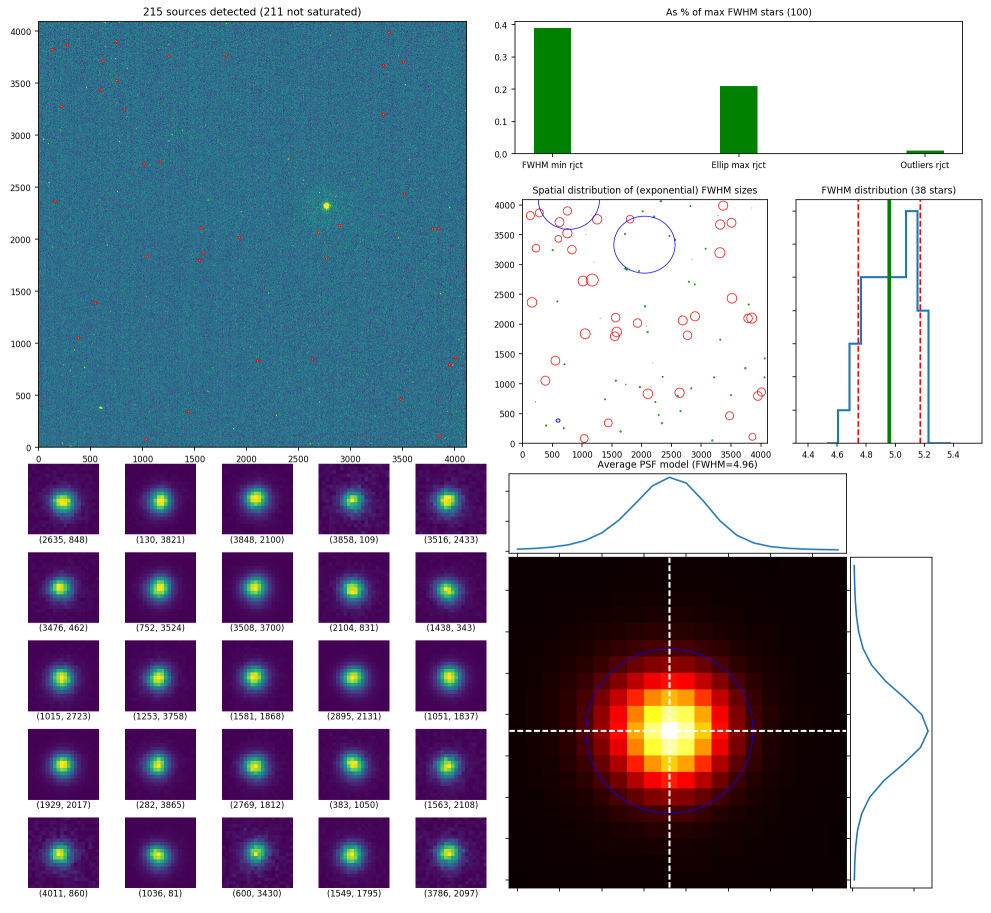

Getting started
===============

.. todo::
   Not finished.

The first step is to estimate the FWHM, sky mean, and sky standard deviation for
the set of standards and the observed field to be processed.

We use the ``getdata.py`` script for this. It generates the following output
files (where ``xxxxx`` is the name of the .fits file):

* ``xxxxx`` **.coo**: output data with x,y coordinates, `FWHM`, ellipticity,
  and relative magnitude values of the stars selected in the  .fits file.

.. parsed-literal::
    # x y FWHM Ellip Mag
    2635.46 847.5 5.076 0.02 3.23
    130.46 3820.8 4.788 0.04 1.91
    3848.14 2100.48 5.224 0.04 2.24
    3858.27 108.83 4.468 0.12 4.26
    ...

* ``xxxxx`` **.png**: output image showing the analysis performed on each
  .fits file processed.

* **getdata.dat**: output file that contains the relevant data found after
  the analysis of either the single .fits file processed, or all the .fits files
  in the processed folder.

.. parsed-literal::
     # image           filter  exposure    Sky_mean  Sky_STDDEV  FWHM_(N_stars)  FWHM_(mean)  FWHM_(std) 
     stk_2153.fits          U      20.0        1.96        3.48              46         4.73        0.70 
     stk_2085.fits          U     250.0       19.36        5.50              14         5.33        0.11 
     stk_2151.fits          U      20.0        1.96        3.48              49         4.31        0.62 
     ....
