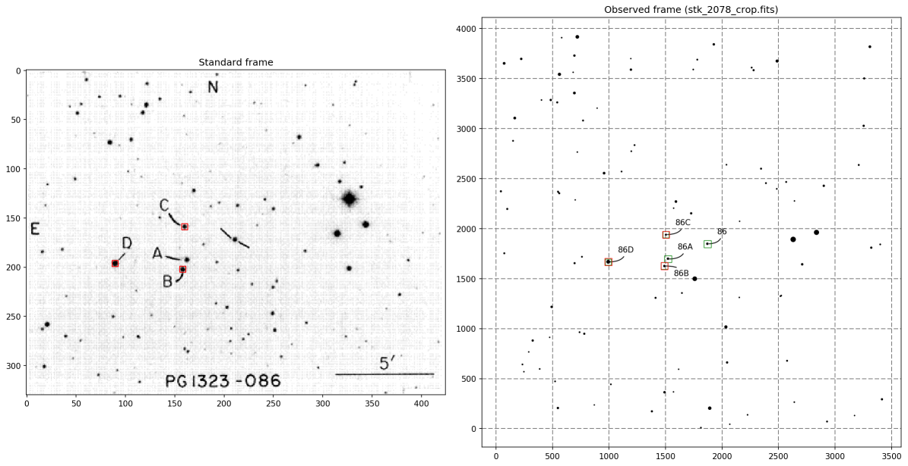

Standard stars photometry
=========================

.. todo::
   Not finished.

This section describes how to obtain instrumental magnitudes for your standards,
and set up the transformation from instrumental to standard. The steps are

* `Identify standard stars`_: identify the coordinates of the stars in the
  observed standard field.
* `Aperture photometry on standard stars`_: obtain aperture photometry for
  each of the selected standard star frames.
* `Define and solve the transformation equations`_: define and fit the
  instrumental to standard transformation equations.

Identify standard stars
-----------------------

The ``id_standard`` script allows the automatic identification of standard
stars in your observed frame, requiring only minimal information.

.. warning::

   This script assumes three things: that you are using `Landolt standards`_,
   that **all** your standard frames are aligned, and that there are **at
   least** three standard stars in your observed Landolt frame.

Landolt equatorial standards are the only set supported currently by the code.
The alignment of your observed standard frames is required since the coordinates
of the standard stars will be transformed to the observed system using a single
observed frame.
The requirement of three standard stars minimum is related to the algorithm
used by the script to perform the transformation to the observed coordinates
system.

The user selects a reference (aligned) observed standards frame, and informs the
script to which Landolt frame it corresponds. The script will then search for
the proper scaling, rotation, and ``x,y`` translation that allows it to identify
which stars in your observed frame are standards.

An image is produced marking the stars in the observed frame that where
identified as standards.

An output file is also generated containing the Landolt stars information, as
well as their ``x,y`` coordinates in the observed system.

.. parsed-literal::
         ID      x      y       V     BV      UB      VR      RI      VI      x_obs      y_obs 
  pg1323-86  211.0  158.3  13.481  -0.14  -0.681  -0.048  -0.078  -0.127   1872.768   1847.208 
 pg1323-86A  162.5  137.5  13.591  0.393  -0.019   0.252   0.252   0.506   1521.456   1695.408 
 pg1323-86B  158.1  128.0  13.406  0.761   0.265   0.426   0.407   0.833   1489.735   1626.427

Define and solve the transformation equations
---------------------------------------------

.. todo::
   Not finished.

.. warning::
  We assume that you will work with a single aperture radius value for the
  standards from all the nights for all the filters.

The aperture value should be large enough to contain as much light from
your observed standards as possible, but at the same time small enough to
minimize contamination from bad pixels and other stars.
The default convention is to use an aperture radius that is ``~4.5*FWHM`` of a
stellar image. This is, for a ``FWHM=3 px`` you'll use an aperture around
``14-15 px``.

Assuming you've already run the ``fitstats`` script, the median FWHM values for
your standard frames are stored in the ``fitstats.dat`` file. 

.. warning::
  If you have more than one exposure per filter for your standard frame, at this
  point you need to select only one. An ideal frame should allow the detection
  of all the standard stars in it. This means no over-exposed saturated stars,
  and no   under-exposed undetectable stars.

This script will obtain instrumental magnitudes for all the observed
standard stars, for each selected frame. The transformation equations are used
to put these magnitudes on the standard system.

.. warning::
  The extinction coefficients for your observed filters are assumed to be known.

.. warning::
  The V filter is assumed to be present among your observed filters.

.. _Landolt standards: http://www.eso.org/sci/observing/tools/standards/Landolt.html